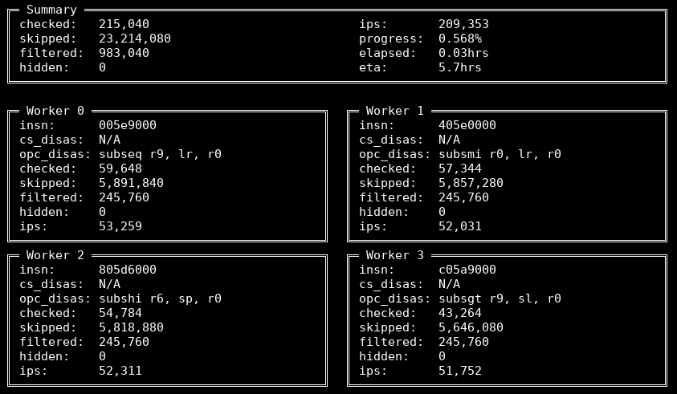

# armshaker
armshaker is a processor fuzzer targeting the Armv8-A ISA. It can be used to find hidden instructions in hardware processors or other implementations of the ISA like emulators.

In essence, it works by executing undefined instructions and checking whether the execution generates an undefined instruction exception or not, in the form of a SIGILL signal sent to the process. If no SIGILL is received, the instruction is marked as hidden and logged. The limited size of the three instruction sets in Armv8-A (A64, A32 and T32) makes it feasible to do an exhaustive search over the whole instruction space using this method.

## Usage

armshaker has two primary parts: the back-end doing most of the work, and a front-end adding visualizations and multiprocessing support. In most cases, the front-end is the preferred way to run the fuzzer.

The fuzzer must be compiled before use, which can usually be done with a simple

```
make
```

in the project directory.

The particular instruction set that is fuzzed depends on the runtime of the current system. If the fuzzer is compiled with a 32-bit (AArch32) toolchain, it will be able to fuzz A32 or T32 (with the `-t` option). If it is compiled with a 64-bit toolchain (AArch64), it will be able to fuzz A64, although cross-compiling and running a 32-bit fuzzer from AArch64 is possible.

Then an exhaustive search of the respective instruction set can be initiated like so:

```
./armshaker.py -f2
```

Which will look something like this:



If a hidden instruction is found, it will be logged in the file `data/logX`, where `X` corresponds to the worker ID. Each log entry will be in the following format: `<instruction_encoding>,hidden,<generated_signal_number>,...`, with register value changes appended if the `-t` (and optionally `-g`) option is set.

In case Python 3 is not available, `shell_frontend.sh` can be used instead for multiprocessing support. Otherwise the fuzzer back-end can be run directly with `./fuzzer <options>`.

## Building

armshaker is only supported on Armv8-A-based systems running Linux, but otherwise requires only a C compiler and Python 3 for the front-end.

The simplest way to compile the fuzzer is to run

```
make
```

in the project directory. This will use the bundled libopcodes disassembler and should work for most use cases.

Optionally, a local installation of libopcodes can be used instead with

```
make SHARED_LIBOPCODES=TRUE
```

Capstone can also be used in addition to libopcodes (note: not instead of). This is mostly a legacy feature, but can be used to compare disassembly results between the two. It can be enabled by adding the `USE_CAPSTONE=TRUE` option when compiling.

## Options

The options available in the front-end are as follows. For more detailed descriptions, see the options for the back-end.

```
$ ./armshaker.py -h
usage: armshaker.py [-h] [-s INSN] [-e INSN] [-c] [-w NUM] [-p] [-n]
                    [-f LEVEL] [-t] [-z] [-g] [-V] [-C]

fuzzer front-end

optional arguments:
  -h, --help            show this help message and exit
  -s INSN, --start INSN
                        search range start
  -e INSN, --end INSN   search range end
  -c, --discreps        Log disassembler discrepancies
  -w NUM, --workers NUM
                        Number of worker processes
  -p, --ptrace          Use ptrace when testing
  -n, --no-exec         Don't execute instructions, just disassemble them.
  -f LEVEL, --filter LEVEL
                        Filter certain instructions
  -t, --thumb           Use the thumb instruction set (only on AArch32).
  -z, --random          Load the registers with random values, instead of all
                        0s.
  -g, --log-reg-changes
                        For hidden instructions, only log registers that
                        changed value.
  -V, --vector          Set and log vector registers (d0-d31, fpscr) when
                        fuzzing.
  -C, --cond            Set cpsr flags to match instruction condition prefix.
```

The back-end has some extra options that can be useful for analysis or targeted fuzzing. Its options are as follows.

```
$ ./fuzzer -h
Usage: ./fuzzer [option(s)]

General options:
    -h, --help              Print help information.
    -q, --quiet             Don't print the status line.

Search options:
    -s, --start <insn>      Start of instruction search range (in hex).
                            [default: 0x00000000]
    -e, --end <insn>        End of instruction search range, inclusive (in
                            hex). [default: 0xffffffff]
    -i, --single-exec       Execute a single instruction (i.e., set end=start).
    -m, --mask <mask>       Only update instruction bits marked in the supplied
                            mask. Useful for testing different operands on a
                            single instruction. Example: 0xf0000000 -> only
                            increment most significant nibble.

Execution options:
    -n, --no-exec           Calculate the total amount of undefined
                            instructions, without executing them.
    -x, --exec-all          Execute all instructions (regardless of the
                            disassembly result).
    -f, --filter <level>    Filter away (skip) certain instructions that would
                            otherwise be executed and might generate false
                            positives. Supports the following levels, where
                            each level includes the numerically lower ones:
                                1: Incorrect disassemblies, mostly caused by
                                   SBO/SBZ bits.
                                2: Hidden instructions caused by Linux bugs
                                   (incorrect udf bkpt, udf uprobes and setend
                                   hooks).
    -p, --ptrace            Execute instructions on a separate process using
                            ptrace. This will generally make execution slower,
                            but lowers the chance of the fuzzer crashing in
                            case hidden instructions with certain side-effects
                            are found. It also enables some additional options.
    -C, --cond              On AArch32: Set the condition flags in the CPSR to
                            match the condition prefix in the instruction
                            encoding. This ensures that undefined instructions
                            with a normally non-matching condition prefix won't
                            be skipped, as is the case in some ISA
                            implementations.

Logging options:
    -l, --log-suffix        Add a suffix to the log and status file.
    -c, --discreps          Log disassembler discrepancies.

Ptrace options (only available with -p option):
    -t, --thumb             Use the thumb instruction set (only available on
                            AArch32). Note: 16-bit thumb instructions have the
                            format XXXX0000. So to test e.g. instruction 46c0,
                            use 46c00000.
    -r, --print-regs        Print register values before/after instruction
                            execution.
    -z, --random            Load the registers with random values, instead of
                            all 0s. Note that the random values are generated
                            at startup, and remain constant throughout the
                            session.
    -g, --log-reg-changes   For hidden instructions, only log registers that
                            changed value.
    -V, --vector            Set and log vector registers (d0-d31, fpscr) when
                            fuzzing.
```

## References

armshaker was inspired by Christopher Domas's [sandsifter](https://github.com/xoreaxeaxeax/sandsifter) project and implemented as part of my master's thesis in computer science, where I used it to fuzz a variety of Armv8-A-based systems. No hidden instructions that could be attributed to hardware were found, but the fuzzing did reveal bugs in the QEMU emulator and the Linux kernel. See the `refs` directory for more information.
